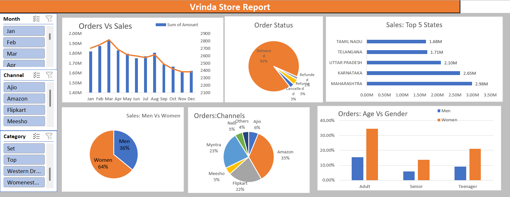

# 📊 Vrinda Store Data Analysis

This project analyzes sales data from Vrinda Store to uncover insights into customer behavior, product trends, and regional performance.

## 🔍 Key Objectives
- Understand monthly sales and order trends  
- Analyze product category and gender-wise sales performance  
- Explore regional performance and top contributing states  
- Visualize channel-wise orders and order status distribution  

## 🛠️ Tools Used
- Microsoft Excel (Pivot Tables, Slicers, Charts, Dashboards)

## 📌 Key Insights
- Women account for a larger share of purchases, especially in the adult and teenager segments  
- Amazon, Myntra, and Flipkart are the most active sales channels  
- Maharashtra and Karnataka are the leading states in terms of revenue  
- Most orders were successfully delivered, with minimal returns or cancellations  
- Monthly sales peaked around March and gradually declined toward the year end  

## 📷 Dashboard Preview

